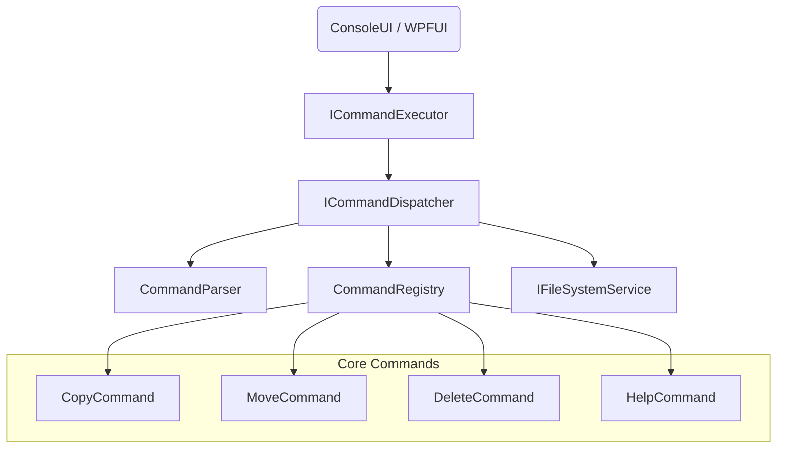

# SmartFileManager — Architecture Overview

This document describes the application architecture, its layers, responsibilities, and key patterns used throughout the project.

---

# 🧱 High-Level Architecture

SmartFileManager follows a layered architecture:

```
UI → AppHost → Core
```

---

## 🗂 Layers

### 1. UI Layer
- ConsoleUI / WPFUI
- Handles user input and displays output

### 2. AppHost
Responsible for:
- Configuring logging
- Setting up DI container
- Initializing the application runtime
- Invoking CompositionRoot

### 3. CompositionRoot
Finalizes the object graph:
- Property injection
- ICommandsAware initialization
- Metadata binding

### 4. Core Layer
Contains business logic:
- Services (FileSystemService, DirectoryService)
- Command execution layer
- All ICommand implementations

---

# 🔧 Dependency Injection

Core registrations are defined in `ServiceCollectionExtensions`:

```csharp
services.AddSingleton<IFileSystemService, FileSystemService>();
services.AddSingleton<ICommandDispatcher, CommandDispatcher>();
services.AddSingleton<ICommand, HelpCommand>();
```

CompositionRoot completes the graph:

```csharp
foreach (var command in commands)
{
    if (command is ICommandsAware aware)
        aware.SetCommands(commands);
}
```

---

# 📊 Architecture Diagram (Mermaid)



---

# 📌 Principles

- Clear separation of concerns
- No cyclic dependencies
- No business logic inside UI
- No `new` usages in Core/UI (except DTOs)
- DI configuration belongs to AppHost

---

# 🚀 Future Architecture Plans

- Introduce Hosted Services
- WebHost support
- Plugin-based architecture
- Fluent configuration API

---